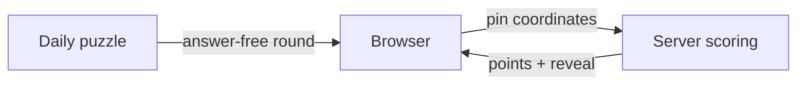

<div align="center">
  

  # Hawker Guessr 🇸🇬

  **Spot the hawker. Pin it on Singapore.**

  A daily geography game for everyone who thinks they know Singapore's hawker centres.

  [](https://hawker-guessr.vercel.app/)

  [](https://nextjs.org/)
  [](https://www.typescriptlang.org/)
  [](https://vitest.dev/)
  [](https://maplibre.org/)
</div>

---

## The game

Hawker Guessr turns Singapore's hawker culture into a quick daily map challenge. Every day brings five photos of real hawker centres. Study the scene, decide where it was taken, and drop your pin on the map.

The closer your guess, the bigger your score. After every round, the game reveals the answer, your distance, a memorable fact about the location, and the photo credit.

> Five photos. Five pins. A maximum of **5,000 points**. How well do you really know Singapore?

### How to play

1. **Study the photo** — signs, architecture, neighbourhood clues, and vibes all count.
2. **Place your pin** anywhere on the Singapore map.
3. **Reveal the answer** and see the distance between your guess and the hawker centre.
4. **Complete five rounds** to build your daily score and streak.
5. **Share your spoiler-free grid** and challenge your friends.

Scores decay smoothly with distance:

```text
points = 1,000 × e^(−distance / 2.2 km)
```

An exact pin earns 1,000 points; a guess 1 km away earns about 635.

## Why it is fun

- **A shared daily puzzle** — everyone gets the same challenge, refreshed at 06:00 SGT.
- **Photo-first deduction** — recognise places through visual details, not trivia prompts.
- **Instant map reveal** — compare your pin with the true location after every guess.
- **Local discoveries** — learn a bite-sized fact about each hawker centre.
- **Spoiler-free sharing** — post your result grid without revealing any answers.
- **No account required** — open the site and start playing.
- **Mobile-first and accessible** — tap controls, keyboard map navigation, and reduced-motion support.

## Built to keep answers secret

Correct locations never ship with the puzzle payload. `GET /api/puzzle` returns a client-safe round with answer fields stripped; `POST /api/guess` validates and scores each guess on the server. A completed round is recorded against an anonymous session so it cannot be replayed for a better score.



## Tech stack

| Area | Technology |
| --- | --- |
| App | Next.js 15, React 19, TypeScript |
| Maps | MapLibre GL with OneMap raster tiles |
| Testing | Vitest |
| Deployment | Vercel |
| Content | Versioned JSON question and hawker-centre banks |
| Identity | Anonymous cookie session + local streak storage |

## Run locally

### Prerequisites

- Node.js 22 or newer
- npm

```bash
git clone git@github.com:PawanPatil19/hawker-guessr.git
cd hawker-guessr
npm install
npm run dev
```

Open [http://localhost:3111](http://localhost:3111).

### Useful commands

```bash
npm run dev          # Start the development server on port 3111
npm run build        # Create a production build
npm run typecheck    # Run TypeScript checks
npm test             # Run the Vitest suite
npm run bank:check   # Validate the question bank
npm run geocode      # Rebuild centre coordinates with OneMap
```

## Project structure

```text
content/                  Hawker centres, questions, and image provenance
public/hawkers/           Locally stored, answer-neutral game photos
scripts/                  Content validation and OneMap geocoding
src/app/                  Next.js pages, metadata, and API routes
src/components/           Game, map, reveal, and sharing UI
src/domain/               Pure scoring, geography, calendar, and type logic
src/hooks/                Client game state machine
src/lib/                  API, sharing, storage, and map helpers
src/server/               Sessions, repositories, validation, and scoring
```

For the product thinking and visual direction, see [PRD.md](PRD.md) and [DESIGN.md](DESIGN.md).

## Add a location

1. Add the hawker centre to `content/centres.json`.
2. Add its question to `content/questions.json` using the matching `centreId`.
3. Store the image in `public/hawkers/` with an answer-neutral filename.
4. Include `imageCredit`, `imageSourceUrl`, and `imageLicense`.
5. Add the approved question ID to `IMAGE_POOL_IDS` in `src/server/puzzle.ts`.
6. Run `npm run bank:check` and `npm test`.

Please use first-party or properly licensed photography. Photo attribution is shown in every reveal.

## Prototype status

The core five-round experience is live and tested. The current content pool covers one five-photo set, reordered for each daily puzzle, and in-memory plays reset when the server redeploys. A larger licensed photo bank and persistent storage are the next steps before leaderboards or accounts.

## Acknowledgements

- Map data and tiles: [OneMap, Singapore Land Authority](https://www.onemap.gov.sg/)
- Map rendering: [MapLibre GL JS](https://maplibre.org/maplibre-gl-js/docs/)
- Every game image retains its source, licence, and creator credit.

<div align="center">
  <strong>Think you know your hawker centres?</strong><br />
  <a href="https://hawker-guessr.vercel.app/">Play today's puzzle →</a>
</div>
